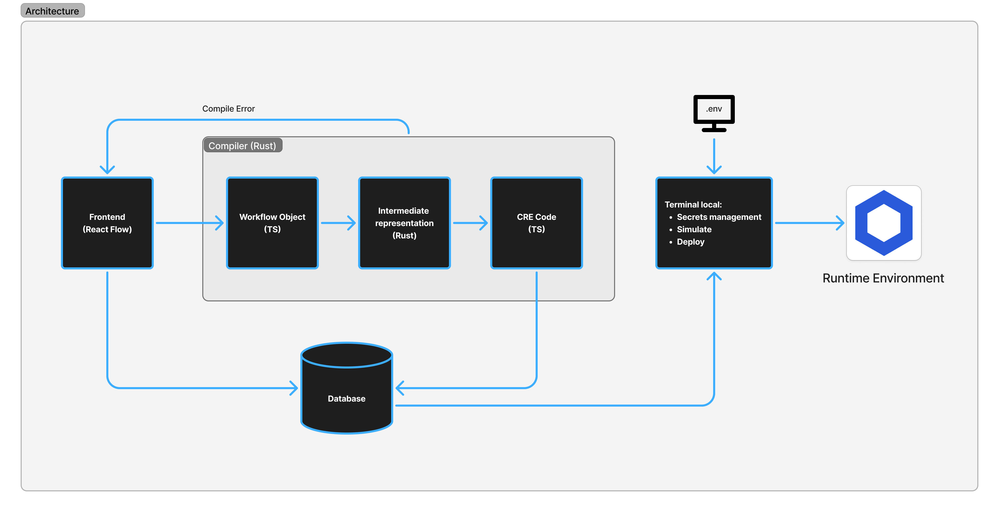

# Overview

6Flow Studio is Tokenization Workflow Platform for CRE: a programmable, low-code orchestration layer for the Chainlink Runtime Environment (CRE).

# Vision

next-gen IDE for Smart Contract Engineers in Financial Enterprise.
It's like an n8n for CRE.

# Architecture



# Chainlink Usages

We built 6Flow on top of Chainlink Runtime Environment (CRE). Here are where we use CRE:
- Compiler outputs a full CRE project bundle (`main.ts`, `workflow.yaml`, `project.yaml`, `secrets.yaml`, config, package, tsconfig, `.env`) in [`compiler/src/codegen/mod.rs`](https://github.com/6flow-studio/6flow-convergence/blob/main/compiler/src/codegen/mod.rs).
- Generated workflow code imports and uses CRE SDK from `@chainlink/cre-sdk` in [`compiler/src/codegen/imports.rs`](https://github.com/6flow-studio/6flow-convergence/blob/main/compiler/src/codegen/imports.rs).
- Generated workflow structure follows CRE patterns (`cre.handler`, `HTTPClient`, `EVMClient`, `runtime.getSecret`, `runtime.report`, `Runner.newRunner`) in [`compiler/tests/snapshots/codegen_basic__branching_workflow_main_ts.snap`](https://github.com/6flow-studio/6flow-convergence/blob/main/compiler/tests/snapshots/codegen_basic__branching_workflow_main_ts.snap).
- Generated `package.json` includes CRE dependency and setup (`@chainlink/cre-sdk`, `bun x cre-setup`) in [`compiler/src/codegen/files.rs`](https://github.com/6flow-studio/6flow-convergence/blob/main/compiler/src/codegen/files.rs).
- Generated workflow manifests are CRE-style artifacts (`workflow.yaml`, `project.yaml`, `secrets.yaml`) in [`compiler/src/codegen/files.rs`](https://github.com/6flow-studio/6flow-convergence/blob/main/compiler/src/codegen/files.rs).
- TUI runs local CRE simulation via CLI command `cre workflow simulate ...` in [`tools/tui/internal/tui/cre_cli.go`](https://github.com/6flow-studio/6flow-convergence/blob/main/tools/tui/internal/tui/cre_cli.go).
- Frontend distributes compiled artifacts as `*-cre-bundle.zip` in [`frontend/src/lib/compiler/download-compiled-zip.ts`](https://github.com/6flow-studio/6flow-convergence/blob/main/frontend/src/lib/compiler/download-compiled-zip.ts).

In short: 6Flow is a visual builder that compiles workflows into native Chainlink CRE projects and executes/simulates them with the CRE toolchain.

# Tech Stack

## Frontend

- NextJS
- Chart: React Flow

## Compiler

- Rust

## Database

- Convex

## Runtime

- Chainlink Runtime Environment

# Project Structure

```bash
.
├── compiler/   # Rust-based compiler for CRE
├── frontend/   # NextJS frontend application
├── shared/     # Shared helper functions and data models across TypeScript codebase
├── tools/      # TUI tooling for local secrets/simulation workflows
```


# Run Locally

While we encourage you to use [6flow.studio](https://6flow.studio) to build your workflow, you can also run it locally.

1. Setup [Convex](https://www.convex.dev/)

2. Add in `/frontend/.env`:
   ```
   CONVEX_DEPLOYMENT=
   NEXT_PUBLIC_CONVEX_URL=
   NEXT_PUBLIC_CONVEX_SITE_URL=
   ETHER_SCAN_API_KEY=
   ALCHEMY_API_KEY=
   ```

3. Use separate terminals for each process.

## Frontend (Next.js)

```bash
cd frontend
npm run dev
```

## Convex

```bash
cd frontend
npx convex dev
```

## TUI (`main.go`)

```bash
cd tools/tui
go run ./cmd/tui/main.go
```
